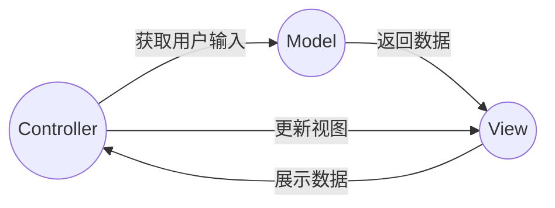
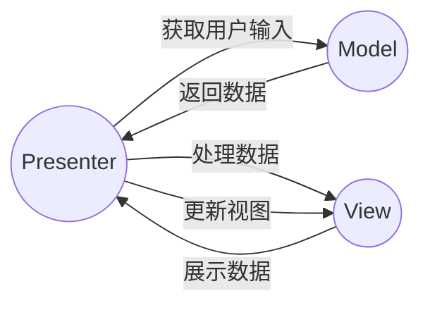
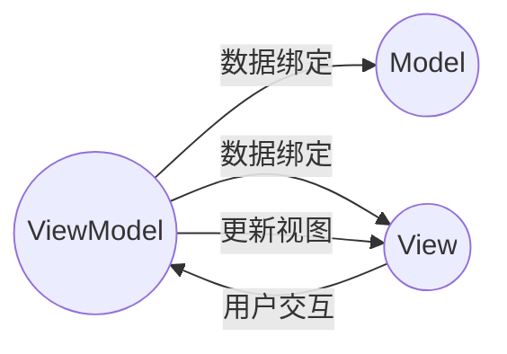
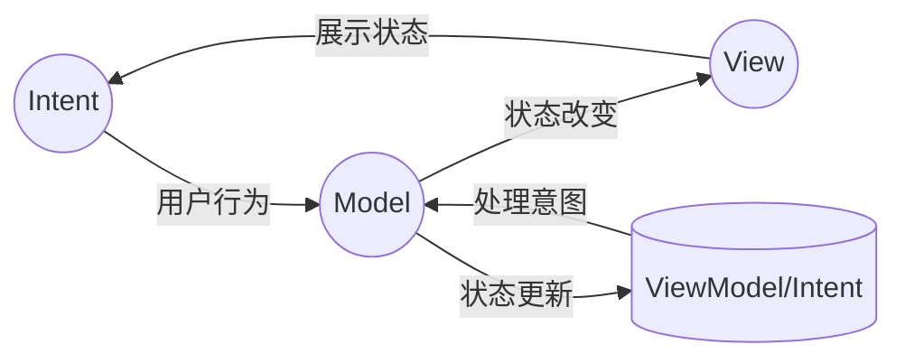

MVC、MVP、MVVM 和 MVI 是软件架构模式，主要用于分离视图（View）、模型（Model）和控制器（Controller）的职责，以提高代码的可维护性和可扩展性。下面是对这些架构的简要说明，以及对应的 Mermaid 流程图。

## MVC (Model-View-Controller)

MVC 是一种经典的架构模式，用于将应用程序分为三个核心组件：

- **Model**：负责数据和业务逻辑。
- **View**：负责展示数据（UI 界面）。
- **Controller**：作为中间人，接收用户输入并调用模型和视图去完成用户的请求。

## MVP (Model-View-Presenter)

MVP 是 MVC 的一个变种，主要区别在于 Presenter 替代了 Controller 的角色：

- **Model**：同 MVC，负责数据和业务逻辑。
- **View**：可以有自己的逻辑，但主要负责展示。
- **Presenter**：接收用户输入，处理业务逻辑，然后更新视图。

## MVVM (Model-View-ViewModel)

MVVM 主要用于数据绑定框架，如 WPF 或 Angular：

- **Model**：负责数据和业务逻辑。
- **View**：只负责展示，不包含逻辑。
- **ViewModel**：作为视图的代理，包含视图的数据和行为。

## MVI (Model-View-Intent)

MVI 是响应式编程架构，常见于使用 Redux 或其他响应式状态管理库的应用程序：

- **Model**：定义应用程序状态的结构。
- **View**：展示状态，不包含业务逻辑。
- **Intent**：用户行为，触发状态的改变。

